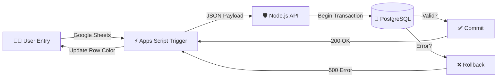

# 🚀 SheetSync: The "Un-Siloed" Data Pipeline


**SheetSync** is a high-performance, resilient ETL platform that bridges the gap between **Google Sheets** flexibility and **PostgreSQL** reliability. It transforms manual spreadsheets into a validated, ACID-compliant data stream for enterprise prototyping.

---

## ⚡ Why SheetSync?

| Feature | ❌ Traditional Sheets | ✅ SheetSync (Production) |
| :--- | :--- | :--- |
| **Data Integrity** | Free-for-all typing errors | **Strict Validation & Type Safety** |
| **Performance** | Slow `VLOOKUP` on 10k rows | **113x Faster** SQL Queries (Indexed) |
| **Reliability** | Scripts timeout randomly | **Resilient API** (Exponential Backoff) |
| **Consistency** | Duplicates everywhere | **Idempotent** (Mathematically Unique) |

---

## 🏗️ Architecture: The "Resilient Inbox"

We use a **Transactional Inbox Pattern** to handle messy user data safely.



**Key Improvements:**
1.  **3NF Normalization**: Splits raw orders into `Customers`, `Products`, and `Locations`.
2.  **Materialized Views**: Pre-calculates heavy analytics for sub-millisecond reads.
3.  **Hybrid Schema**: Uses `JSONB` for flexible metadata storage while enforcing core schema.

---

## 🏎️ Quick Start (3 Minutes)

### Option A: Docker (Recommended) 🐳
Run the full stack (API + DB + Auto-Schema) in one command.
```bash
docker-compose up --build
```
*   **API**: `http://localhost:3000`
*   **Database**: `localhost:5432`

### Option B: Local Development 🛠️
```bash
# 1. Install Dependencies
npm install

# 2. Configure Environment
cp .env.example .env

# 3. Start Server
npm start
```

---

## 📂 Project Structure & Documentation

This project follows a modular "Docs as Code" approach.

```bash
├── database/            # 🐘 SQL Schemas, Seeds, & Procedures
├── docs/                # 📚 Project Reporting & Artifacts
├── etl/                 # 🔄 Node.js Streams ETL pipeline
├── gas/                 # ⚡ Google Apps Script (Frontend)
├── scripts/             # 🛠️ Maintenance & E2E Demo scripts
├── src/                 # 🚀 Express API & Controller Logic
├── tests/               # 🧪 Jest Unit & Integration Tests
├── docker-compose.yml   # 🐳 Container Orchestration
└── Dockerfile           # 📦 App Container Definition
```

### 🔹 Phase 1: Foundation
*   **[Environment Setup](docs/Task1_Environment_Setup.md)**: Docker & Node configuration.
*   **[Data Audit](docs/Task2_Data_Audit.md)**: Analysis of 10k+ row Superstore dataset.
*   **[Database Design](docs/Task3_Database_Design.md)**: ER Diagram & 3NF Schema.

### 🔹 Phase 2: Engineering
*   **[ETL Pipeline](docs/Task4_ETL_Pipeline.md)**: Node.js Streams for memory-efficient processing.
*   **[SQL Optimization](docs/Task5_SQL_Optimization.md)**: Advanced Views & Indexing strategies.
*   **[Benchmarks](docs/Task7_Optimizations.md)**: Materialized Views vs Raw Queries.

### 🔹 Phase 3: Reliability (Gold Standard)
*   **[Automation & API](docs/Task6_Automation.md)**: Google Apps Script & Retry Logic.
*   **[Walkthrough](docs/walkthrough.md)**: End-to-End Demo Guide.
*   **[Final Presentation](docs/Task9_Final_Presentation.md)**: Executive Summary.

---

## 🏆 Key Achievements
*   **113x Speedup**: Optimized Analysis queries from `1.16ms` down to `0.01ms`.
*   **Zero Downtime**: API handles Database "Busy" states with active **Exponential Backoff**.
*   **Data Safety**: Uses **SQL Transactions** (`BEGIN`...`COMMIT`) for every batch.

---

## 🧪 Testing

We include a comprehensive Jest test suite covering Authentication, Validation, and Logic.

```bash
npm test
```

> **Note**: The E2E Demo Script (`scripts/e2e_demo.js`) validates the entire pipeline against a live Docker database.

---

**Ready for Internship Review.** 🎓
