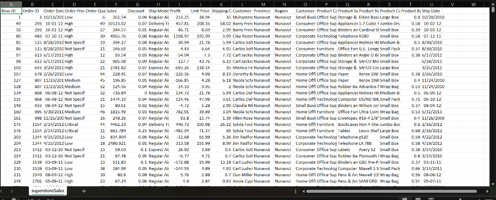

#  Data Audit & Assessment – Superstore Sales

## 1️⃣ Dataset Overview

* **Records:** 8,399 rows
* **Columns:** 21
* **Source Type:** Transactional sales data
* **Grain:** *One row = one product line item per order*
* **Screenshot:**

---

## 2️⃣ Entities, Attributes & Relationships

### 🧩 Identified Entities

| Entity         | Description                   | Primary Key              |
| -------------- | ----------------------------- | ------------------------ |
| **Order**      | Customer purchase transaction | `Order ID`               |
| **Customer**   | Buyer placing the order       | `Customer Name`          |
| **Product**    | Item being sold               | `Product Name`           |
| **Shipment**   | Logistics & delivery info     | `(Order ID + Ship Date)` |
| **Sales Fact** | Financial & quantity metrics  | `Row ID`                 |

---

### 🧬 Entity–Attribute–Relationship (EAR) Table

| Entity     | Attribute            | Type          | Notes                       |
| ---------- | -------------------- | ------------- | --------------------------- |
| Order      | Order ID             | Integer       | Business key                |
| Order      | Order Date           | Date (string) | Needs type conversion       |
| Order      | Order Priority       | Categorical   | Low / High / Not Specified  |
| Order      | Ship Mode            | Categorical   | Regular Air, Delivery Truck |
| Order      | Ship Date            | Date (string) | Should be DATE              |
| Customer   | Customer Name        | String        | No surrogate ID (risk)      |
| Customer   | Customer Segment     | Categorical   | Consumer, Corporate, SMB    |
| Customer   | Region               | String        | Redundant with Province     |
| Customer   | Province             | String        | Geo hierarchy               |
| Product    | Product Name         | String        | High cardinality            |
| Product    | Product Category     | Categorical   | Office Supplies, etc        |
| Product    | Product Sub-Category | Categorical   | Nested under category       |
| Product    | Product Container    | Categorical   | Box, Drum, etc              |
| Product    | Product Base Margin  | Float         | **Missing values present**  |
| Sales Fact | Row ID               | Integer       | Surrogate key               |
| Sales Fact | Order Quantity       | Integer       |                             |
| Sales Fact | Unit Price           | Float         |                             |
| Sales Fact | Sales                | Float         | Derived metric              |
| Sales Fact | Discount             | Float         |                             |
| Sales Fact | Profit               | Float         |                             |
| Sales Fact | Shipping Cost        | Float         |                             |

---

### 🔗 Relationships

* **Order 1 → N Sales Fact**
* **Customer 1 → N Order**
* **Product 1 → N Sales Fact**
* **Order 1 → 1 Shipment**

---

## 3️⃣ Data Quality Issues Identified

### ❌ Missing Values

| Column              | Missing Count | Impact                         |
| ------------------- | ------------- | ------------------------------ |
| Product Base Margin | **63**        | Affects profitability analysis |

✔ Recommendation:

* Impute using **subcategory average**
* OR flag as `UNKNOWN_MARGIN`

---

### ⚠️ Inconsistencies

| Issue                            | Description               |
| -------------------------------- | ------------------------- |
| Date fields stored as strings    | `Order Date`, `Ship Date` |
| Customer identified only by name | Risk of duplicates        |
| Region = Province in some cases  | Redundant geography       |
| “Not Specified” priority         | Needs standardization     |

---

### 🔁 Duplicates

* **Exact duplicate rows:** ❌ None
* **Logical duplicates risk:**

  * Same `Customer Name` across regions
  * Same `Product Name` without product ID

---

## 4️⃣ Column Mapping (Source → Target Schema)

### 🎯 Target: Analytics-Ready Star Schema

#### 🟦 Fact_Sales

| Source Column  | Target Column    |
| -------------- | ---------------- |
| Row ID         | sales_id         |
| Order ID       | order_id         |
| Product Name   | product_id (FK)  |
| Customer Name  | customer_id (FK) |
| Order Quantity | quantity         |
| Unit Price     | unit_price       |
| Sales          | total_sales      |
| Discount       | discount         |
| Profit         | profit           |
| Shipping Cost  | shipping_cost    |

---

#### 🟩 Dim_Customer

| Source Column    | Target Column |
| ---------------- | ------------- |
| Customer Name    | customer_name |
| Customer Segment | segment       |
| Region           | region        |
| Province         | province      |

---

#### 🟨 Dim_Product

| Source Column        | Target Column |
| -------------------- | ------------- |
| Product Name         | product_name  |
| Product Category     | category      |
| Product Sub-Category | sub_category  |
| Product Container    | container     |
| Product Base Margin  | base_margin   |

---

#### 🟥 Dim_Order

| Source Column  | Target Column |
| -------------- | ------------- |
| Order ID       | order_id      |
| Order Date     | order_date    |
| Order Priority | priority      |
| Ship Mode      | ship_mode     |
| Ship Date      | ship_date     |

---

## 5️⃣ Screenshots of Data Issues (What to Capture)

📸 Suggested screenshots for submission:

1. **Source Data Snapshot** (captured above)
2. **Missing Product Base Margin rows**
3. **Order Date & Ship Date as text**
4. **Customer Name duplication across regions**

---

## 6️⃣ Final Recommendations

✅ Convert date columns → `DATE`
✅ Introduce surrogate keys (`customer_id`, `product_id`)
✅ Normalize geography (Region → Province → Country)
✅ Handle missing margins explicitly
✅ Build star schema for BI / dashboards
