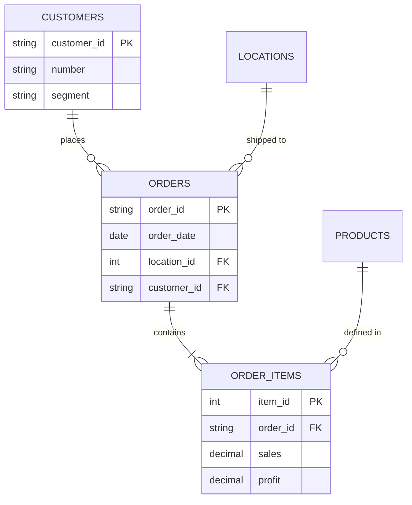

# 📌 Task 3: Database Design & ER Diagram

## 1. Schema Design (3NF Normalized)
We converted the flat "Global Superstore" spreadsheet into a normalized relational schema to eliminate redundancy and ensure data integrity.

### Entities & Constraints
1.  **Customers**: `customer_id` (PK), stored once per person. `segment` is constrained to valid business types.
# 📘 Task 3: Database Design & ER Diagram

## **📌 Objective**
Design a normalized (3NF), scalable PostgreSQL schema to store Superstore sales data, optimizing for transactional integrity and query performance.

## **🏗️ ER Diagram & Architecture**
Using **Mermaid.js** for visualization, we modeled the following relationships:



## **📐 Normalization Process (3NF)**
1.  **1NF (Atomic Values)**: Ensured all columns (e.g., `Product Name`) contain atomic values, not comma-separated lists.
2.  **2NF (Partial Dependencies)**: Removed columns that depended only on part of the key. `Product Name` depends on `Product ID`, not the Order. Moved to `products` table.
3.  **3NF (Transitive Dependencies)**: Removed `City` and `State` from `orders`. These depend on `location_id`. Created a dedicated `locations` table.

## **🛡️ Integrity Constraints**
*   **Primary Keys**: Natural keys (`order_id`, `customer_id`) used where stable; Surrogate keys (`location_id SERIAL`) used for composite location data.
*   **Foreign Keys**: `ON DELETE CASCADE` applied to `order_items` to ensure if an Order is deleted, its items don't become orphans.
*   **Check Constraints**: `CHECK (segment IN ('Consumer', 'Corporate', ...))` ensures data validity at the database level.
*   **Uniqueness**: `UNIQUE (city, state, country)` on `locations` prevents duplicate address entries.

## **⚡ Optimization Strategy**
*   **Indexes**:
    *   `idx_orders_date` on `orders(order_date)` for date-range filtering.
    *   `idx_items_product` on `order_items(product_id)` for product performance analysis.
*   **Data Types**:
    *   `DECIMAL(10,2)` for money (Sales, Profit) to avoid floating-point math errors.
    *   `VARCHAR(50)` for IDs to save space compared to `TEXT`.
    }

    ORDERS {
        varchar order_id PK
        date order_date
        date ship_date
        varchar ship_mode
        varchar customer_id FK
        int location_id FK
        timestamp created_at
    }

    ORDER_ITEMS {
        int item_id PK
        varchar order_id FK
        varchar product_id FK
        decimal sales
        int quantity
        decimal discount
        decimal profit
    }
```

## 3. Optimizations Implementation
*   **Indexes**: Created `idx_orders_date` (for filtering by date range), `idx_orders_customer` (for customer history), and `idx_items_product` (for product performance).
*   **Data Types**: Used `DECIMAL` for money (not Float), `DATE` for dates, and `VARCHAR` with appropriate lengths.
*   **Constraints**: Enforced Referee Integrity (`FOREIGN KEY`) and Business Logic (`CHECK segment`).

## 4. SQL Scripts Deliverables
*   **Schema**: [superstore_schema.sql](../database/superstore_schema.sql)
*   **Seed Data**: [seed.sql](../database/seed.sql)
