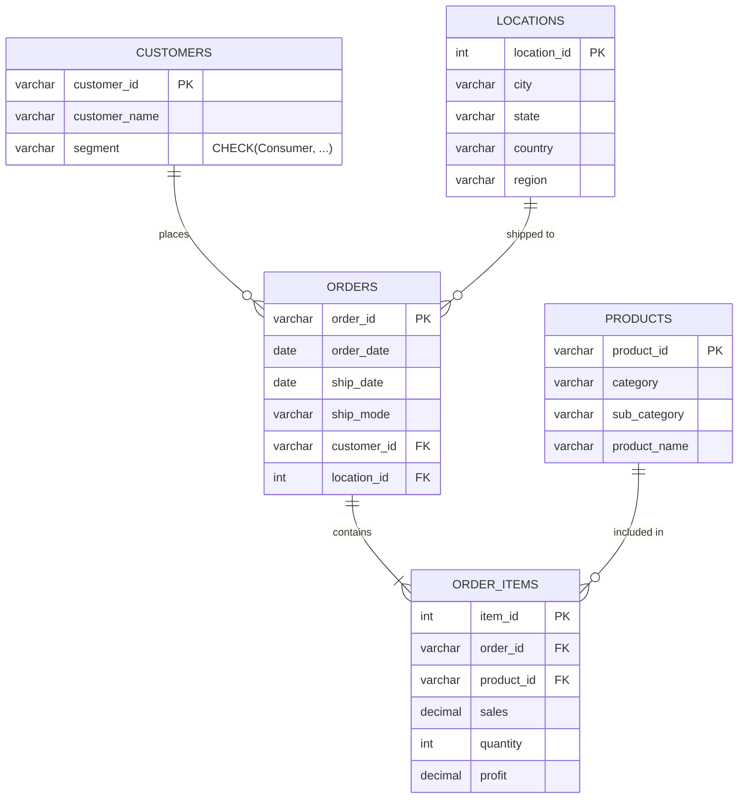

# 📌 Task 3: Database Design & ER Diagram

**Status**: ✅ Completed
**Date**: 2025-12-14

## 1. Schema Design (3NF Normalized)
We converted the flat "Global Superstore" spreadsheet into a normalized relational schema to eliminate redundancy and ensure data integrity.

### Entities & Constraints
1.  **Customers**: `customer_id` (PK), stored once per person. `segment` is constrained to valid business types.
2.  **Products**: `product_id` (PK), category hierarchy (`category` -> `sub_category`).
3.  **Locations**: Deduplicated based on `City + State + Country`.
4.  **Orders**: The "Header" of a transaction. Links to Customer and Location.
5.  **Order_Items**: The "Line Items". Links to Product and Order.

## 2. ER Diagram
Below is the Entity-Relationship Diagram showing relationships and cardinality.

## 3. Optimizations Implementation
*   **Indexes**: Created `idx_orders_date` (for filtering by date range), `idx_orders_customer` (for customer history), and `idx_items_product` (for product performance).
*   **Data Types**: Used `DECIMAL` for money (not Float), `DATE` for dates, and `VARCHAR` with appropriate lengths.
*   **Constraints**: Enforced Referee Integrity (`FOREIGN KEY`) and Business Logic (`CHECK segment`).

## 4. SQL Scripts Deliverables
*   **Schema**: [superstore_schema.sql](../database/superstore_schema.sql)
*   **Seed Data**: [seed.sql](../database/seed.sql)
